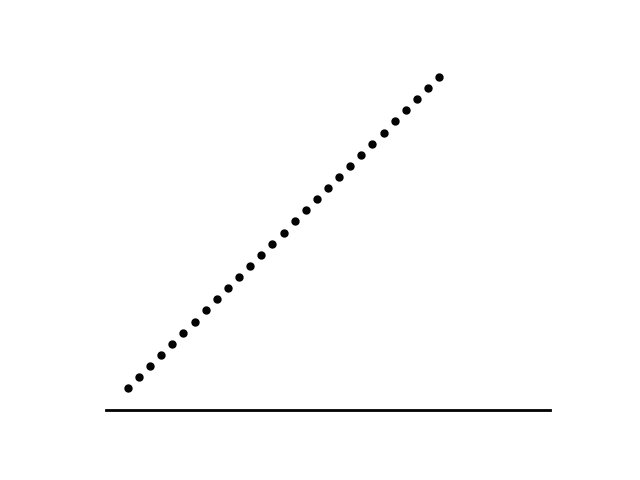
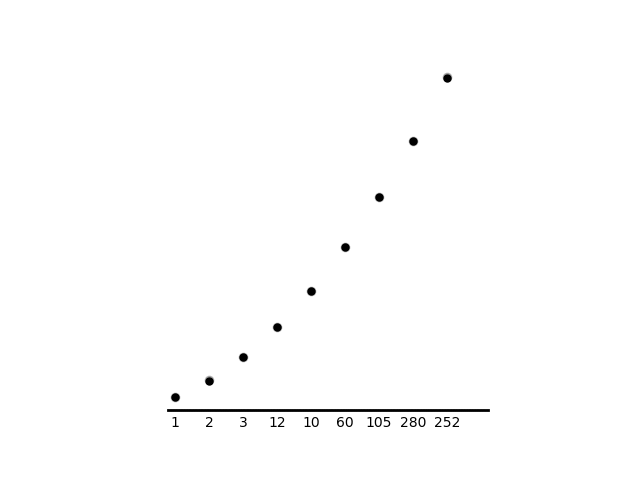

The animation below shows a a variety of balls dropped from varying heights and experiencing perfectly elastic collisions that cause the balls to always return to their initial heights. The natural question to ask when watching it is "when will it repeat on its own?" In general, the analysis of this problem is simple, but I suspect actually finding the solutions is an intractable problem because the period of a ball (the time it takes to return to its initial position) is proportional to the square root of its initial height. We can, however, consider special cases where solutions are easy to come by, and this is the case for the second animation shown.

Let T_n denote the period of the nth ball and let there be an integer a_n corresponding to each T_n.

For m balls to all be at their initial position at the same time, we must have the condition (a_1)(T_1)=(a_2)(T_2)=...=(a_m-1)(T_m-1)=(a_m)(T_m)

The number of times the ball with the largest period must bounce for the system to return to its initial configuration is the least common multiple of all a_n.

We can find the least common multiple of all a_n by using a program that iterates through each integer. If the max period is T_max, then for each ball we need to find a_max so that [(a_max)(T_max)]/T_n = an integer. If the program counts up, then the first integer that satisfies the condition will be the number of times the ball with the highest period must bounce.

The animation below shows the special case, and the number below each ball indicates the number of times that particular ball must bounce for that ball and all balls left of it to be at their initial positions.

This analysis is not specific to bouncing balls but to any system composed of periodic motion.
