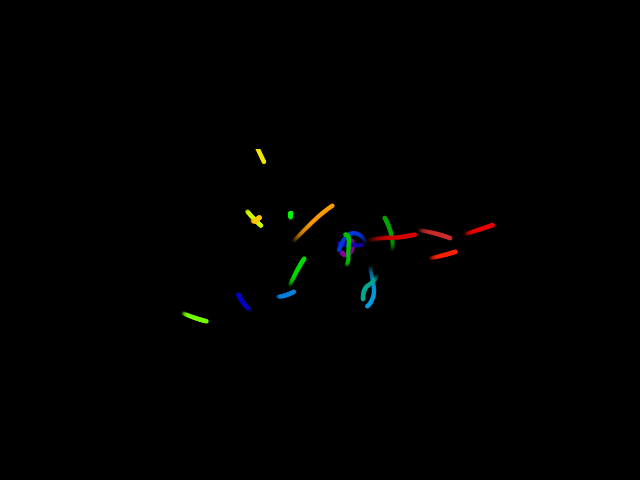

There are a lot of things going on in this animation, and it is very finiky. There are many work-arounds in the code that may look strange, such as graphing the same point multiple times. These work-arounds are in fact necessary to make the animation look best. A slightly altered version of mplanimations is used in the creation of this animation so that the tails are oriented backwards instead of the usual way.

The animation is created by running an simulation of the n-body problem with the intial starting points of the object being my name, and then the resulting animation is simply reversed to make the objects form my name from different initial conditions.

Some test animations are also available:

